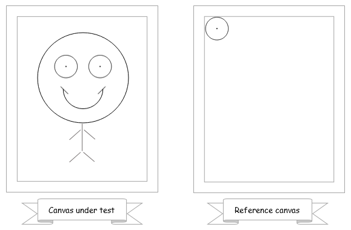

[](https://travis-ci.org/cristiingineru/rabbit)
[](https://codeclimate.com/github/cristiingineru/rabbit)
[](https://david-dm.org/cristiingineru/rabbit)
[](https://david-dm.org/cristiingineru/rabbit?type=dev)

# Overview

Rabbit is a JavaScript library for writing tests for code drawing on canvas.

It's using [Canteen](https://github.com/platfora/Canteen) to spy all the calls to a canvas and provides higher level abstraction functions and Jasmine checkers for finding and inspecting the shapes being drawn.

Rabbit is not doing image recognition and it's not testing the beauty. Only the human eye can test it so for this purpose it's recommended to create catalogs with the drawing or animation under test to allow a fast scan and issue detection. Something simple like this [catalog](https://rawgit.com/cristiingineru/rabbit/master/examples/face/catalog.html).

This library is meant to be used for component testing - basically to test that the functions are wired correctly and the resulted image contains the expected elements or that these elements are following simple rules like specific position, size, alignment or coloring.


# How it's working

A second canvas has to be used as a reference. The test writer is responsible for drawing on this reference canvas anything that he expects the canvas under test to contain. Every function call to these canvases are being recorded by Canteen and used by Rabbit to perform a sequence recognition ignoring the positions, sizes, colors, and all other styles. If the reference will be found in the canvas under test multiple times then all the instances will be returned.



Then the test writer can assert that the found instances have certain properties like a specific position in the canvas under test, size, alignment or color. Rabbit will provide such checkers!


# Usage

* Set up [Canteen](https://github.com/platfora/Canteen/blob/master/README.md)
* Create a Rabbit object. One per test suite is enough:
```js
var rabbit = new Rabbit();
```
* Optional: add the Rabbit matchers to Jasmine:
```js
jasmine.addMatchers(rabbit.customMatchers);
```
* Let your code under test draw on canvas.
* Create a reference drawing in a different canvas. It can be a simple circle, rectangle or anything you expect your canvas under test to contain.
* Get the call records from both the canvases using Canteen:
```js
var canvasUnderTestStack = canvasUnderTest.getContext('2d').stack();
var referenceCanvasStack = referenceCanvas.getContext('2d').stack();
```
* Use Rabbit to find whether the canvas under test contains the reference:
```js
var found = rabbit.findAllShapesIgnoringArguments(referenceCanvasStack, canvasUnderTestStack);
expect(found.length).toBe(1);
```
* Or just use a custom matcher:
```js
expect(referenceCanvasStack).toBePartOf(canvasUnderTestStack);
```


# Documentation

- [Example specs](https://github.com/cristiingineru/rabbit/blob/master/examples/face/face.spec.js)
- [getBBox supported features catalog](https://rawgit.com/cristiingineru/rabbit/master/catalog/catalog.html)
- [API description](./API.md)
